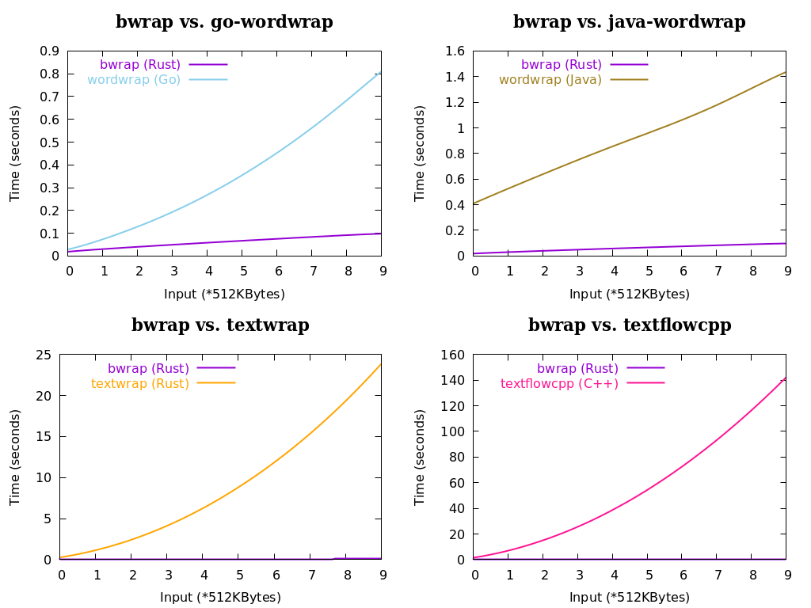

- [How to run](#orge088b67)
  - [Prerequisites](#orgc682f25)
- [About the benchmark](#org8ad8a9b)
- [Examples](#orgc1ad53a)


<a id="orge088b67"></a>

# How to run

```bash
git clone --depth=1 https://github.com/micl2e2/bench-wrap-libs
cd bench-wrap-libs

# start benchmark
bash bench-all.bash
```


<a id="orgc682f25"></a>

## Prerequisites

1.  A Linux distribution.
2.  At least, the following programs are installed:
    1.  bash
    2.  coreutils
    3.  valgrind
    4.  gnuplot
    5.  cargo(minimal profile)
    6.  g++(gcc or clang)
    7.  jdk, mvn
    8.  go


<a id="org8ad8a9b"></a>

# About the benchmark

Note: if anyone finds out that, there is improper or unfair usage of any of selected libraries, or there is any other counterpart missed in this benchmark, please feel free to [open an issue](https://github.com/micl2e2/bench-wrap-libs/issues/new).

Below are the details of this benchmark:

1.  (**Random Samples**) Samples' content looks like:
    
    ```
    abaaebdd c a deeccadd cbcbedbaeadecbdbccbdbeeaaa bacecddd cb cdcabcdccdceecca cc aeebeaee bededdbddddad ae d bcaacccaba eccdc   cadc aac   eddedbada  babbd bbb bbbcdd aecd becc ab debb   daecbeddaedaaebaccba edd dac d  adba c ebba dc aeede   bcdde bed b eb ddbdaacbe bda   aa d
    ```
    
    , which simulates an English article as close to reality as possible. They are **generated randomly** from the characters pool consisting of alphabets "abcde" and ASCII space " ", it results in 10 files of size ranging from 512KB to 5MB(the approximate size of plain-text version of the Bible).

2.  (**Same Task**) All libraries are assigned the **same task**: take samples from standard in, wrap them with an 80-width limit, then print out the result to standard out.

3.  (**Correct Enough**) Although all libraries' results are distinct from each other, they are **correct enough**, i.e., no lines exceed the 80-width limit.

4.  While all libraries are measured in "time elapsed" benchmark, not all will do so in "memory peak" benchmark. This is because their memory allocation mechanism, are completely different from the one used by system programming lang like C/C++ or Rust.


<a id="orgc1ad53a"></a>

# Examples

On a i5-3337u/8G machine, the benchmark will take about 20min, and the result will be similar to:



